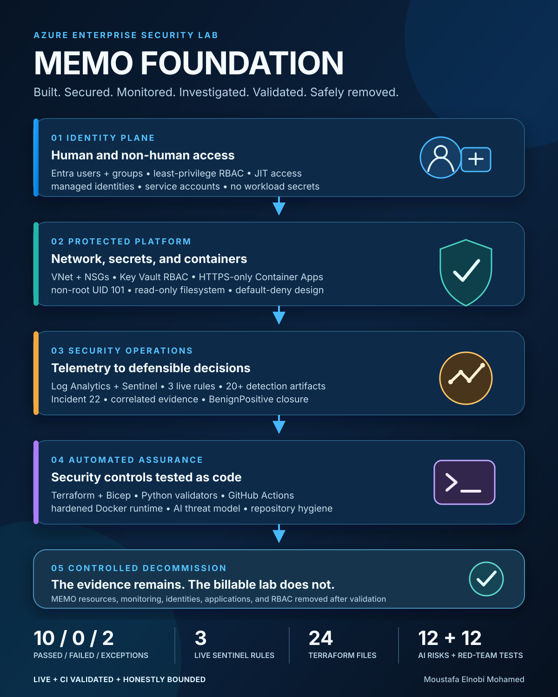

# MEMO Foundation: Final Public Rehearsal and Technical Review

## Purpose

This is the exact rehearsal for presenting MEMO Foundation publicly, to a recruiter, or during a technical interview.

The main walkthrough is designed for 12 to 15 minutes. It proves the full engineering lifecycle without overstating the implementation boundary. A five-minute version and a technical question bank follow the main script.



## The one-sentence story

I built a production-inspired Azure security environment, secured its human and workload identities, centralized and investigated its telemetry, converted the controls into testable code, documented the remaining risks honestly, and then removed the live environment so it could not become an unattended bill.

## Accuracy rules

Use these words consistently:

- **Live:** Entra users and groups, RBAC, managed identities, networking and NSGs, Key Vault controls, Container Apps, Sentinel rules and automation, the incident investigation, and selected Bicep deployments.
- **CI validated:** Terraform modules, the hardened Docker workload, Bicep compilation, Python assurance, and repository hygiene.
- **Validated design:** Kubernetes security manifests and controls.
- **Design-only:** the Security Operations AI Assistant architecture and threat model.
- **Decommissioned:** the Azure workload, monitoring resources, lab identities, applications, service principals, and MEMO role assignments were removed after final evidence was captured.

Never say that AKS, ACR, paid Defender plans, private endpoints, Logic Apps, or an AI service were deployed.

## Before presenting

### 1. Prepare the screen

1. Close Azure Portal, Cloud Shell, email, and every tab containing tenant IDs, subscription IDs, object IDs, costs, or personal information.
2. Open the repository in a clean browser window.
3. Set browser zoom to 90% or 100%.
4. Collapse the GitHub sidebar if it reduces the space available for the file content.
5. Open the following tabs in this order:

   1. `README.md`
   2. `docs/architecture/MEMO-Security-Architecture.md`
   3. `docs/RBAC/RBAC-Matrix.md`
   4. `infrastructure/containers/memo-secure-app/Dockerfile`
   5. `infrastructure/kubernetes/deployment.yaml`
   6. `detections/sentinel/rules/rbac-privilege-change.json`
   7. `docs/evidence/day14/incident-22-investigation.md`
   8. `.github/workflows/security-validation.yml`
   9. `docs/architecture/ai-security/ai-security-architecture.md`
   10. `docs/reports/day15-final-security-validation.md`
   11. `docs/reports/day16-project-closeout.md`

### 2. Prepare the local validation

From the repository root, run:

```bash
git status --short
git log -5 --oneline
python3 -m py_compile automation/python/*.py
python3 automation/python/validate_repo_artifacts.py
python3 automation/python/validate_ai_security_design.py
python3 automation/python/validate_repository_hygiene.py
python3 automation/python/validate_readme.py
```

Expected outcome:

- Clean or intentionally explained Git status
- Every validator returns zero failures
- No secret, state, credential, personal-data, empty-file, or oversized-file finding

Do not run deployment commands during the public walkthrough. The live lab has been intentionally decommissioned. Use the saved evidence and successful GitHub Actions run as proof.

### 3. Rehearse the transitions

Do not read filenames aloud. State the engineering reason first, then open the artifact that proves it.

Use this pattern throughout:

> Problem, decision, implementation, evidence, limitation.

## Main 12-to-15-minute walkthrough

### 0:00 to 0:45 | Hook

**Show:** The README title and final measurements table.

**Say:**

> Most cloud projects end when the application works. I wanted this one to prove the entire security lifecycle. I designed the enterprise, deployed selected Azure controls, protected both human and non-human identities, centralized telemetry, built and tuned detections, investigated an incident, validated the repository through CI, documented the remaining risk, and then safely decommissioned the environment. This is MEMO Foundation.

**Point to:** `Assurance controls failed: 0`, `Live Sentinel rules: 3`, `Terraform files validated: 24`, `Kubernetes objects validated: 12`, and `AI risks and red-team tests: 12 each`.

**Transition:**

> The numbers matter, but the architecture explains how the controls connect.

### 0:45 to 2:00 | Business problem and architecture

**Show:** `docs/architecture/MEMO-Security-Architecture.md` and the lifecycle visual.

**Say:**

> MEMO Foundation is a fictional enterprise, not a collection of unrelated portal exercises. Employees and analysts authenticate through Entra ID. Groups and Azure RBAC enforce separation of duties. Managed identities give workloads access without credentials in code. Network segmentation, Key Vault, and Container Apps form the protected platform. Azure Activity and diagnostic data flow into Log Analytics and Microsoft Sentinel. Sentinel turns that telemetry into detections, investigation, and response. Terraform, Bicep, Python, and GitHub Actions make the controls repeatable and testable.

**Decision to explain:**

> I separated the identity plane, platform plane, security operations plane, and assurance plane because a failure in one layer should not silently remove every control.

**Transition:**

> I started with identity because every other control depends on knowing who or what is requesting access.

### 2:00 to 3:20 | Human identity, groups, and RBAC

**Show:** `docs/RBAC/RBAC-Matrix.md`, then `automation/powershell/01-create-users.ps1` and `02-add-users-to-groups.ps1` if more detail is requested.

**Say:**

> I modeled the organization with department-based Entra users and security groups, then assigned access to groups instead of creating one-off permissions for individuals. The RBAC matrix documents who needs access, at what scope, and why. That provides separation of duties, reduces permission drift, and makes access reviews understandable. Just-in-time scripts separately model privileged elevation, use, and revocation.

**Key answer if challenged:**

> The project used least privilege as a design decision, not as a slogan. Permissions were scoped to the task and resource. The public repository contains sanitized identities, while the original object IDs stayed out of the portfolio.

**Transition:**

> Human access was only half the identity problem. The application also needed an identity.

### 3:20 to 4:20 | Non-human identity and secrets

**Show:** The README implementation boundary, then `infrastructure/workloads/docs/workload-identity.md` and `automation/terraform/modules/keyvault/main.tf`.

**Say:**

> I used managed identities for workloads so the application did not need a client secret embedded in code, a container image, or a pipeline variable. Key Vault used Azure RBAC authorization, soft delete, diagnostic monitoring, and a deletion lock. The workload identity received only the role needed to read secrets.

**Residual-risk answer:**

> Purge protection remained disabled so the temporary lab could be fully removed, and public network access remained enabled because private connectivity was excluded for cost. I recorded both as exceptions and applied compensating controls instead of calling them passes.

**Transition:**

> Once identity and secrets were controlled, I secured the path to the workload and the workload itself.

### 4:20 to 5:40 | Network and container platform

**Show:** `automation/terraform/modules/networking/security-rules.tf`, then `infrastructure/containers/memo-secure-app/Dockerfile`.

**Say:**

> The network design uses VNet and subnet segmentation with NSGs. Management access is limited to controlled RDP and SSH paths rather than broad inbound rules. The public application was deployed to Azure Container Apps using the Consumption profile, HTTPS ingress, a system-assigned identity, a quarter vCPU, half a gibibyte of memory, and a scale range of zero to one replica.

> The container itself runs as UID and GID 101, uses a read-only filesystem, drops Linux capabilities, and was tested with runtime security-header checks. The point was to secure both the Azure service configuration and the process inside the container.

**Transition:**

> I also wanted to prove that the same workload could be expressed with stronger orchestration controls without paying for AKS.

### 5:40 to 6:50 | Kubernetes security, honestly bounded

**Show:** `infrastructure/kubernetes/deployment.yaml`, `network-policy.yaml`, and `rbac.yaml`.

**Say:**

> Kubernetes is a validated design, not a claimed AKS deployment. The manifests enforce restricted pod security, non-root execution, a read-only root filesystem, dropped capabilities, RuntimeDefault seccomp, disabled automatic service-account token mounting, namespaced RBAC, resource limits, and default-deny network policy. Twelve objects were validated offline and through prior temporary-cluster evidence.

**Why this matters:**

> I chose not to deploy AKS or ACR only to produce a screenshot. The security controls are inspectable and validated, while the implementation boundary stays honest.

**Transition:**

> A secure configuration is incomplete if nobody can see or investigate what happens inside it.

### 6:50 to 8:20 | Telemetry and detection engineering

**Show:** `detections/sentinel/rules/rbac-privilege-change.json`, then the detection inventory in `docs/evidence/day14/02-sentinel-rules-inventory.jpg`.

**Say:**

> Azure Activity and diagnostic telemetry fed Log Analytics and Microsoft Sentinel. I deployed three representative analytics rules: RBAC privilege changes, repeated failed Azure operations, and failed Key Vault secret access. The repository includes more than twenty additional KQL and detection artifacts, but I did not deploy rules without supporting telemetry.

> Each live rule was treated as an engineering object. I considered the query window, threshold, entity mapping, MITRE mapping, grouping, suppression, and the operational response. Deploying every possible rule would have created inactive detections, noise, and misleading coverage.

**KQL explanation:**

> My queries first establish the relevant event set, normalize fields that vary between records, summarize activity into an investigation-ready result, and preserve the identifiers an analyst needs to pivot.

**Transition:**

> The best proof of a detection is not that it exists. It is what happens after it fires.

### 8:20 to 9:40 | Incident 22 investigation

**Show:** `docs/evidence/day14/incident-22-investigation.md`, followed by the correlation and closure screenshots.

**Say:**

> Incident 22 demonstrated the complete investigation lifecycle. I reviewed the alert context, correlated the event with Azure Activity, evaluated the actor, operation, scope, result, and surrounding changes, and documented the evidence. The activity looked suspicious enough to investigate but matched expected lab administration, so I closed it as BenignPositive with the reason SuspiciousButExpected.

> I did not close it just because I recognized the action. I closed it because the telemetry supported the conclusion. The classification preserves the distinction between a rule that behaved correctly and an actual compromise.

**Transition:**

> After proving the operational workflow, I turned the project into something that could continuously test itself.

### 9:40 to 11:10 | Infrastructure as code and DevSecOps

**Show:** `.github/workflows/security-validation.yml`, `automation/python/memo_security_validator.py`, and the successful workflow evidence.

**Say:**

> Terraform defines reusable modules for networking, storage, Key Vault, identity, private connectivity, and secure compute. Bicep defines selected governance, Sentinel, and Defender-related controls. Python validators inspect sanitized evidence, repository artifacts, the AI design, README structure, and public-repository hygiene.

> GitHub Actions separates validation into three independent jobs: Python Security Assurance, Terraform and Bicep, and Hardened Docker Runtime. The workflow has read-only repository permissions and does not persist checkout credentials. A failure in one domain remains visible instead of being buried inside one long job.

**Exact proof line:**

> The final workflow completed successfully across all three jobs, and the final assurance result was PASS_WITH_EXCEPTIONS, with ten passed controls, zero failed controls, and two documented exceptions.

**Transition:**

> On the final day, I extended the same security discipline to AI without pretending that a design document was a deployed service.

### 11:10 to 12:20 | Secure AI architecture

**Show:** `docs/architecture/ai-security/ai-security-architecture.md` and `ai-threat-model.md`.

**Say:**

> The Security Operations AI Assistant is explicitly design-only. It uses managed identity, least-privilege RBAC, restricted tools, prompt-injection defenses, sensitive-data minimization, output validation, human approval for every state-changing action, monitoring, cost limits, and a kill switch. The threat model contains twelve risks and twelve adversarial tests.

> I did not deploy a paid AI endpoint because an unvalidated service would have added cost without producing credible operational evidence. The honest result is a deployment-ready security boundary and test plan, not a false production claim.

**Transition:**

> Cost was not a cleanup task. It was one of the security constraints from the beginning.

### 12:20 to 13:25 | Cost governance and residual risk

**Show:** README `Cost-aware engineering` and `Scope and limitations`.

**Say:**

> I excluded paid Defender workload plans, AKS, ACR, Logic App playbooks, private endpoints, and AI services. Container Apps scaled from zero to one replica. Thirty-day Log Analytics evidence recorded 3.881714 megabytes ingested and 0.063201 megabytes marked billable. The goal was not to claim that Azure is always free. It was to prove that architecture decisions, quotas, evidence, and teardown can keep a student lab controlled.

> The final result intentionally records two residual risks rather than hiding them. Security engineering includes explaining what remains, why it remains, and what would change in production.

**Transition:**

> The last control was making sure the completed lab could not quietly become next month's bill.

### 13:25 to 14:20 | Controlled decommission

**Show:** `docs/reports/day16-project-closeout.md` and sanitized zero-count teardown evidence when it is added.

**Say:**

> After the release was validated, I performed a controlled decommission. I removed the MEMO resource groups, Azure workloads, Sentinel and Log Analytics, locks, lab users, groups, app registrations, enterprise applications, service principals, and remaining RBAC assignments. I protected the signed-in administrator with an exact allowlist and count-based safety gate. The final Azure queries returned no MEMO resource groups, resources, or workspaces.

> The architecture, code, evidence, decisions, failures, and fixes remain public. The billable lab does not.

**Transition:**

> That is what turned this from a deployment exercise into a complete security engineering project.

### 14:20 to 15:00 | Close

**Return to:** The README project outcome.

**Say:**

> MEMO Foundation demonstrates identity engineering, non-human identity security, network and secrets protection, container hardening, Kubernetes security, detection engineering, incident response, infrastructure as code, DevSecOps, secure AI design, cost governance, and safe teardown. The most important lesson was simple: do not just claim that a control works. Build it, test it, break it, fix it, document the remaining risk, and know how to remove it safely.

> The repository is public, and every claim I made today has an artifact or evidence path behind it.

Stop speaking. Leave the repository URL visible for three seconds.

## Five-minute version

### 0:00 to 0:30

Use the main hook.

### 0:30 to 1:15

Explain the four connected planes: identity, protected platform, security operations, and automated assurance.

### 1:15 to 2:00

Show the RBAC matrix, managed identity design, Key Vault controls, and hardened container.

### 2:00 to 3:00

Show the three Sentinel rules and Incident 22. Explain why it was closed as `BenignPositive` rather than dismissed without evidence.

### 3:00 to 4:00

Show the three GitHub Actions jobs and state the final `PASS_WITH_EXCEPTIONS` result.

### 4:00 to 5:00

Explain the AI design-only boundary, the two residual risks, cost choices, and the controlled decommission. End with the repository URL.

## Live terminal demonstration

Use this only when the audience asks to see the validation run.

```bash
git status --short
python3 -m py_compile automation/python/*.py
python3 automation/python/validate_repo_artifacts.py
python3 automation/python/validate_ai_security_design.py
python3 automation/python/validate_repository_hygiene.py
python3 automation/python/validate_readme.py
```

Then say:

> These validators do not prove that every security property is perfect. They prove that the documented artifacts, required controls, sanitized evidence, threat model, and repository hygiene remain consistent. Runtime and infrastructure validation are handled separately by the other CI jobs.

## Technical question bank

### Why only three live Sentinel rules when the repository has more than twenty detection artifacts?

Because only those three had telemetry that supported meaningful validation. Deploying rules without data would create false confidence, inactive content, and unnecessary operational noise.

### Why did you close Incident 22 as benign positive?

The rule correctly identified activity that deserved review. Correlation with Azure Activity showed that the actor, scope, operation, result, and surrounding changes matched expected lab administration. `BenignPositive` preserves that the detection was valid while the activity was authorized.

### Why not use a client secret for the application?

Managed identity removes the need to distribute, rotate, store, and potentially leak a workload credential. Azure issues tokens to the identity, and RBAC limits what the workload can do.

### What would you change in production?

I would enable Key Vault purge protection, private endpoints, restricted public network access, production-grade workload protection, longer telemetry retention, tested automated playbooks, formal access reviews, PIM-backed elevation, and separate subscriptions or management groups for environment isolation.

### Why is the result PASS_WITH_EXCEPTIONS instead of PASS?

Two known risks remained: purge protection was disabled for lab teardown, and Key Vault public access remained enabled because private connectivity was outside the cost boundary. Both were documented with compensating controls.

### Was Kubernetes deployed to AKS?

No. The manifests and security controls were validated, including prior temporary-cluster evidence, but AKS and ACR were deliberately excluded for cost. The repository labels Kubernetes as a validated design.

### Was the AI assistant deployed?

No. It is design-only. The project includes the security architecture, twelve risks, twelve adversarial tests, tool restrictions, human approval boundaries, monitoring, and shutdown controls.

### How did you prevent the public repository from leaking sensitive information?

The closeout removed a binary Terraform plan, hardcoded temporary credentials, tenant-specific identifiers, personal information, obsolete cleanup logic, empty placeholders, and malformed artifacts. Automated hygiene checks now detect prohibited secret and state files, credential patterns, personal data, oversized files, and empty tracked files.

### What was the strongest engineering decision?

Separating what was live, CI validated, validated as a design, and design-only. That made the evidence credible and prevented the portfolio from overstating coverage.

### What was the hardest technical lesson?

Cloud security controls are interconnected. A detection depends on telemetry, telemetry depends on diagnostic configuration, investigation depends on useful entity context, and automation must respect identity and approval boundaries. Building isolated controls is easier than proving the full chain.

### How did you control cost?

I excluded services that did not justify their cost, used Container Apps Consumption with zero-to-one replicas, limited ingestion, measured billable data, avoided unsupported live detections, documented the boundary, and removed the entire environment after evidence collection.

### How would you respond if the RBAC rule fired in production?

I would identify the actor, target principal, assigned role, scope, time, source, ticket or change record, and surrounding activity; determine whether the grant increased privilege; contain unauthorized access; preserve evidence; revoke or correct the assignment; and tune the rule only if the event represented approved recurring behavior.

## Recording checklist

- [ ] Use a clean browser profile.
- [ ] Turn off notifications.
- [ ] Hide bookmarks and personal tabs.
- [ ] Record at 1080p or better.
- [ ] Keep the cursor still while speaking.
- [ ] Zoom only when evidence is too small to read.
- [ ] Do not scroll while explaining a key sentence.
- [ ] Do not expose Azure object IDs, tenant IDs, subscription IDs, emails, costs, or tokens.
- [ ] Say `design-only` when presenting AI.
- [ ] Say `validated design` when presenting Kubernetes.
- [ ] Say `CI validated` when presenting Terraform and Docker.
- [ ] Show the successful Actions run.
- [ ] Show the two documented exceptions.
- [ ] Show the sanitized teardown zero counts.
- [ ] End with the repository URL visible.

## Final quality gate

The rehearsal is ready when all of these are true:

1. The main recording is under 15 minutes.
2. Every claim maps to a repository artifact.
3. No live, validated, or design-only boundary is blurred.
4. No personal or tenant-specific value appears on screen.
5. The local Python validators and GitHub Actions are green.
6. The final teardown proof is sanitized.
7. The closing sentence is delivered from memory.
