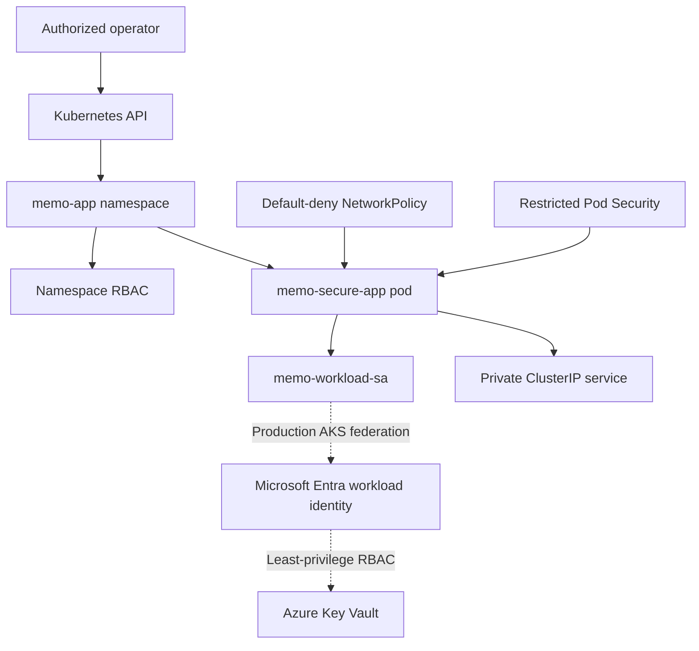

# MEMO Foundation Kubernetes Security

## Overview

This folder contains a security-first Kubernetes workload design for the MEMO Foundation enterprise lab. The manifests were deployed and validated in a temporary browser-based Kubernetes environment to avoid creating billable Azure Kubernetes Service resources.

The implementation is designed to map directly to a production AKS architecture while preserving the project requirement of zero Azure spending.

## Deployment scope

| Component | Implementation status |
|---|---|
| Kubernetes manifests | Implemented and stored in Git |
| Temporary cloud Kubernetes deployment | Deployed and validated |
| Azure Container Apps workload | Deployed separately in the MEMO Azure environment |
| AKS cluster | Not deployed because worker nodes are billable |
| Microsoft Entra Workload ID | Production design documented, not activated in the temporary cluster |
| Azure Key Vault integration | Existing MEMO Key Vault and workload identity mapped as the production target |
| Defender for Containers | Not enabled because it is a paid Defender for Cloud plan |

## Security architecture



The temporary validation environment exercised the solid-line Kubernetes controls. The dotted path represents the intended production AKS integration with the existing MEMO managed identity and Key Vault.

## Implemented controls

| Security area | Control | Result |
|---|---|---|
| Namespace isolation | Dedicated `memo-app` namespace | Passed |
| Pod admission | Restricted Pod Security enforcement, audit, and warnings | Passed |
| Runtime identity | Container runs as UID/GID 101 | Passed |
| Privilege protection | Privileged mode disabled and privilege escalation blocked | Passed |
| Linux capabilities | All capabilities dropped | Passed |
| System-call protection | `RuntimeDefault` seccomp profile | Passed |
| Filesystem protection | Read-only root filesystem | Passed |
| Temporary storage | Memory-backed `/tmp` limited to 16 MiB | Passed |
| Credential exposure | Automatic service-account token mounting disabled | Passed |
| Workload permissions | Application service account receives no Kubernetes API permissions | Passed |
| Auditor permissions | Read-only namespace role without secret access or modification rights | Passed |
| Network segmentation | Default-deny ingress and egress | Passed |
| Required egress | DNS only on TCP/UDP port 53 | Passed |
| Service exposure | Internal `ClusterIP`, no public load balancer | Passed |
| Resource governance | CPU and memory requests and limits | Passed |
| Availability | Readiness and liveness probes | Passed |

## Manifest inventory

| File | Purpose |
|---|---|
| `namespace.yaml` | Creates the isolated namespace and applies restricted Pod Security labels |
| `service-account.yaml` | Creates the workload identity boundary without automatic token mounting |
| `configmap.yaml` | Stores non-sensitive application configuration |
| `secret-example.yaml` | Demonstrates secret structure using a non-sensitive placeholder only |
| `deployment.yaml` | Deploys the hardened non-root application container |
| `service.yaml` | Provides private in-cluster application access |
| `rbac.yaml` | Implements the read-only auditor role and binding |
| `network-policy.yaml` | Enforces default-deny networking and explicitly allows required traffic |

## Validation results

The workload was deployed to a two-node temporary Kubernetes cluster and reached a healthy state with one available replica and zero restarts.

The following tests were performed:

- Confirmed the container ran as UID 101 rather than root.
- Confirmed `allowPrivilegeEscalation` was set to `false`.
- Attempted to write to `/security-test` and received a read-only filesystem error.
- Confirmed no Kubernetes service-account token directory was mounted.
- Confirmed the workload service account could not list pods or read secrets.
- Confirmed the auditor service account could list pods.
- Confirmed the auditor could not read secrets or delete deployments.
- Attempted to create an insecure pod and confirmed restricted Pod Security denied it.
- Confirmed the private application responded locally.
- Confirmed default-deny egress blocked outbound HTTP.
- Confirmed three NetworkPolicy resources were active.

Evidence is stored under [`docs/evidence/day12`](../../docs/evidence/day12/).

## Production AKS workload identity mapping

The production identity path is designed as follows:

1. The pod uses Kubernetes service account `memo-workload-sa` in namespace `memo-app`.
2. AKS exposes an OpenID Connect issuer.
3. A federated identity credential trusts the subject `system:serviceaccount:memo-app:memo-workload-sa`.
4. Microsoft Entra Workload ID exchanges the projected Kubernetes token for an Azure access token.
5. The existing MEMO user-assigned managed identity receives only the required Azure role.
6. The identity uses the existing `Key Vault Secrets User` assignment scoped to `MEMO-KV-SECURITY`.
7. The application retrieves approved secrets at runtime without storing Azure credentials in Git or Kubernetes YAML.

This architecture removes long-lived application secrets and creates a traceable non-human identity boundary.

## Reproduction

Apply the namespace first, followed by the remaining manifests:

```bash
kubectl apply -f namespace.yaml
kubectl apply \
  -f configmap.yaml \
  -f service-account.yaml \
  -f rbac.yaml \
  -f secret-example.yaml \
  -f deployment.yaml \
  -f service.yaml \
  -f network-policy.yaml
```

Check deployment health:

```bash
kubectl rollout status deployment/memo-secure-app \
  --namespace memo-app \
  --timeout=120s

kubectl get all --namespace memo-app --output wide
```

Do not apply these manifests to a paid cloud cluster without first reviewing cost, networking, identity, registry, monitoring, and regional requirements.

## SC-500 alignment

This implementation provides hands-on coverage of:

- Security controls for Kubernetes and Azure application platform services
- Managed identities and workload identities
- Azure Key Vault access design
- Least-privilege RBAC
- Network segmentation and explicit traffic policy
- Secure compute configuration
- Infrastructure as code security controls
- Container workload posture and runtime risk concepts

## Limitations and next production controls

The temporary environment was used for validation rather than production. A production implementation should additionally include:

- Private AKS API access
- Microsoft Entra-integrated AKS authentication
- Microsoft Entra Workload ID federation
- Private Azure Container Registry with managed-identity image pulls
- Images pinned by digest instead of a floating tag
- CI/CD image scanning, SBOM generation, signing, and admission verification
- Azure Policy for Kubernetes governance
- Centralized audit and runtime telemetry
- Defender for Containers after cost approval
- Microsoft Sentinel integration after ingestion and retention costs are approved

These controls were not claimed as deployed in this zero-cost lab.
