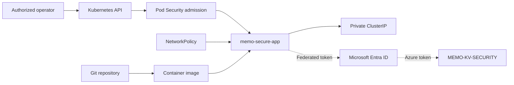

# MEMO Kubernetes Workload Threat Model

## Purpose

This threat model evaluates the `memo-secure-app` Kubernetes workload, its identities, network paths, configuration, and intended Azure integrations. It distinguishes controls validated in the temporary Kubernetes environment from controls reserved for a future production AKS deployment.

## Protected assets

- Application container and configuration
- Kubernetes namespace and API resources
- Kubernetes service-account identities
- Microsoft Entra workload identity
- Azure Key Vault secrets
- Container image integrity
- Application availability
- Audit and security evidence

## Trust boundaries

1. Operator to Kubernetes API
2. Kubernetes control plane to worker node
3. Namespace to pod
4. Pod to service account
5. Pod-to-pod and pod-to-network communication
6. Kubernetes workload identity to Microsoft Entra ID
7. Managed identity to Azure Key Vault
8. Source repository and image supply chain to the running workload

## Data flow



The Entra and Key Vault path is the documented production design. It was not activated in the temporary validation cluster.

## Threat analysis

| Threat                         | Scenario                                                      | Security impact                           | Mitigation                                                                                      | Validation                                          |
| ------------------------------ | ------------------------------------------------------------- | ----------------------------------------- | ----------------------------------------------------------------------------------------------- | --------------------------------------------------- |
| Privileged container           | An attacker deploys a container capable of host-level actions | Privilege escalation and node compromise  | Restricted Pod Security, non-root execution, privileged mode disabled, all capabilities dropped | Insecure pod was denied                             |
| Container breakout             | The workload abuses unnecessary kernel functionality          | Host compromise                           | `RuntimeDefault` seccomp and dropped capabilities                                               | Deployment configuration verified                   |
| Root filesystem modification   | Malware writes tools or persistence into the image filesystem | Persistence and tampering                 | Read-only root filesystem with limited memory-backed `/tmp`                                     | Write attempt to `/security-test` failed            |
| Stolen Kubernetes token        | An attacker reads an automatically mounted API credential     | Unauthorized API access                   | `automountServiceAccountToken: false`                                                           | Token directory was absent                          |
| Excessive workload permissions | The application identity lists or modifies cluster resources  | Lateral movement and control-plane abuse  | Workload service account has no Kubernetes RBAC permissions                                     | Pod listing and secret access returned `no`         |
| Auditor privilege abuse        | A read-only identity accesses secrets or modifies workloads   | Secret disclosure or sabotage             | Namespace-scoped read-only Role without secret or write verbs                                   | Secret access and deployment deletion returned `no` |
| Unauthorized pod deployment    | A user attempts to deploy an insecure workload                | Policy bypass and expanded attack surface | Restricted Pod Security enforcement                                                             | Admission controller rejected the pod               |
| Lateral movement               | A compromised pod scans or connects to other workloads        | Expanded compromise                       | Default-deny ingress and egress                                                                 | NetworkPolicies active                              |
| Command-and-control egress     | Malware communicates with an external host                    | Data exfiltration and remote control      | Default-deny egress with DNS-only exception                                                     | Outbound HTTP test was blocked                      |
| Public exposure                | A service is unintentionally published to the internet        | External exploitation                     | `ClusterIP` service and no LoadBalancer or Ingress                                              | Service type verified as `ClusterIP`                |
| Resource exhaustion            | A compromised or faulty container consumes node resources     | Denial of service                         | CPU and memory requests and limits                                                              | Manifest configuration verified                     |
| Embedded Azure credentials     | Azure secrets are stored in Git or Kubernetes YAML            | Credential theft                          | Production Workload ID and Key Vault design                                                     | No real secret stored in manifests                  |
| Supply-chain compromise        | A malicious or vulnerable image is deployed                   | Code execution in the cluster             | Future image digest pinning, scanning, SBOM, signing, and admission verification                | Residual risk                                       |
| Runtime attack                 | A process exploits an application flaw after deployment       | Workload compromise                       | Hardened runtime baseline; future Defender for Containers and centralized telemetry             | Partially mitigated                                 |

## Negative security tests

### Insecure pod admission

An `nginx:alpine` pod without the required security context was submitted to the restricted namespace. Admission was denied because it allowed privilege escalation, retained unrestricted capabilities, lacked non-root enforcement, and did not declare an approved seccomp profile.

### Read-only filesystem

The running application attempted to create `/security-test`. The operation failed because the root filesystem was mounted read-only.

### Workload RBAC

The workload service account was tested for pod listing and secret access. Both requests were denied.

### Auditor RBAC

The auditor was allowed to list pods but denied access to secrets and denied permission to delete deployments.

### Network egress

The application responded on its local port, confirming workload health. A separate outbound HTTP request failed under the default-deny egress policy.

## Workload identity threat controls

The production AKS design uses the subject:

```text
system:serviceaccount:memo-app:memo-workload-sa
```

This subject is federated to the existing MEMO user-assigned managed identity. Azure RBAC limits that identity to `Key Vault Secrets User` at the `MEMO-KV-SECURITY` scope.

The intended controls are:

- No client secret in application code
- No Azure password in Kubernetes Secret objects
- Federated trust restricted to one namespace and one service account
- Least-privilege Azure role assignment
- Key Vault as the system of record for secrets
- Azure Activity Log and Key Vault diagnostics in a cost-approved production environment

## Residual risks

| Residual risk                             | Reason                                                          | Planned treatment                                          |
| ----------------------------------------- | --------------------------------------------------------------- | ---------------------------------------------------------- |
| Floating container tag                    | `alpine` can resolve to a different image later                 | Pin the approved image digest                              |
| No image vulnerability report             | Scanner was not added to the temporary lab                      | Add CI image scanning and retain the report                |
| No image signature enforcement            | The sandbox does not implement admission signature verification | Add signing and policy enforcement in production           |
| No runtime EDR                            | Paid Defender for Containers was intentionally not enabled      | Enable only after cost approval                            |
| No centralized Kubernetes audit ingestion | Log Analytics and Sentinel ingestion can create costs           | Configure after budget and retention approval              |
| Temporary cluster                         | The playground is not a production Azure environment            | Reproduce in AKS when funded                               |
| Example Kubernetes Secret                 | Base64 encoding is not encryption                               | Replace application secrets with Key Vault and Workload ID |

## Risk decision

The project intentionally avoided AKS worker-node charges, Azure Container Registry charges, Defender for Containers charges, and log-ingestion charges. The temporary cloud cluster was sufficient to validate Kubernetes-native controls without creating a false claim of production deployment.

The remaining production risks are accepted for the zero-cost lab and documented for a funded implementation.